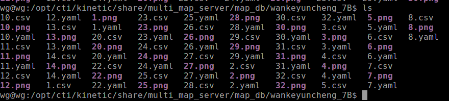
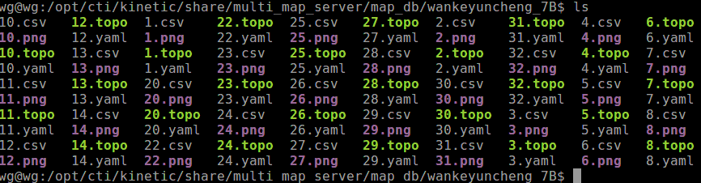
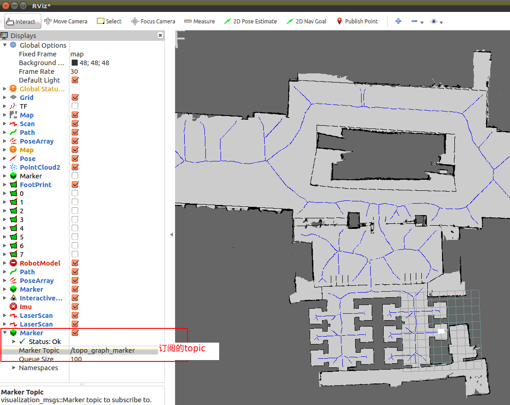
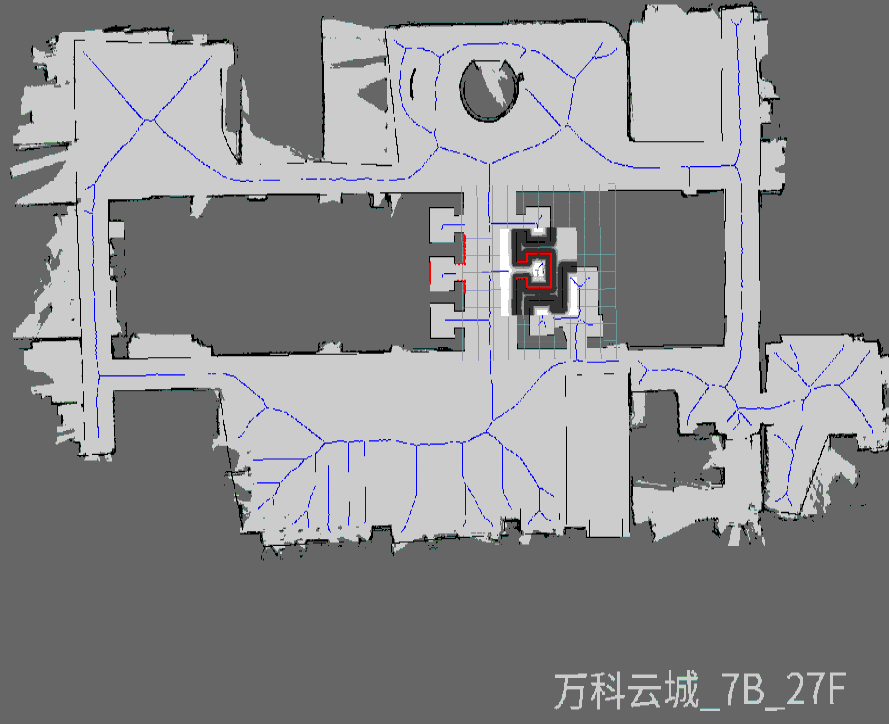
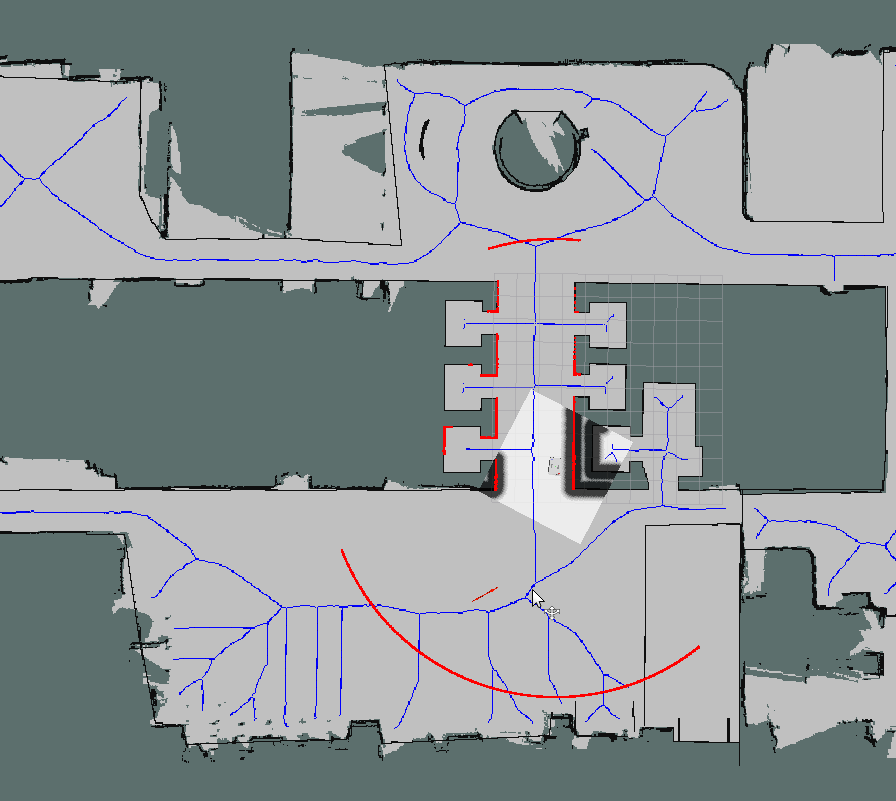

# Introduction

## 关于topomap的最小依赖包__备份__

| 包名             | 描述               |
| :--------------- | :----------------- |
| topomap_tools    | 生成topo工具包     |
| topo_planner     | 给予topomap 规划包 |
| topo_publish     | topomap 发布包     |
| wankeyuncheng_7B | 测试用例地图       |

### 编译

```
mkdir -p catkin_ws/src
cd catkin_ws/src
git clone https://gitlab.ctirobot.com/candle/planning/topomap
cd catkin_ws 
catkin_ws
```

​    

>  批量生成*.topo拓扑图文件

```shell
$ source topomap_tools 工作环境
# 进入到地图文件
$ cd wankeyuncheng_7B/
$ ls  如图1
# 执行指令批量批量生成*.topo 如图2
$ rosrun topomap_tools topomap_generator_node --all
```

1. 图1 



2. 图2




> 可视化*.topo文件

```shell
$ source topomap_tools 工作环境
# 进入到地图文件
$ cd wankeyuncheng_7B/
# rosrun topomap_tools topomap_loader_node 楼层
$ rosrun topomap_tools topo_publisher_node 1  # 图3
```

3. 图3

   


roslaunch 方式启动 topomap_loader_node

```shell
$ source topomap_tools 工作环境
# 进入到地图文件 可视化发布(roslaunch topo_publish graph_publisher.launch 只发布cti_msgs/Graph msgs 没有可视化)
$ roslaunch topomap_tools topo_publisher.launch 
# rospotic 指令切换地图 图4 切换后
$ rostopic pub /active_map cti_msgs/ChangeMapCmd "building: 'wankeyuncheng_7B'
level: '27'" 
```

4. 图4 

   

   ### 使用拓扑图作为move_base 全局规划

   修改文件:  

   ```
   /comom/robot/br_navigation/param/BR204/move_base_params.yaml
   base_global_planner: "topo_graph_planner/TopoGraphPlanner"
   ```

   重启仿真 指点导航



#### topo_planner_server 服务

```shell
roslaunch topo_planner topo_graph_server.launch 

rosnode info /topo_graph_server
--------------------------------------------------------------------------------
Node [/topo_graph_server]
Publications: 
 * /plan2 [nav_msgs/Path]
 * /rosout [rosgraph_msgs/Log]

Subscriptions: 
 * /graph_map [unknown type]
 * /navigation_map [unknown type]
 * /zones [unknown type]

Services: 
 * /topo_graph_server/get_itst_plan
 * /topo_graph_server/get_loggers
 * /topo_graph_server/make_plan
 * /topo_graph_server/set_logger_level

服务API
rosservice info /topo_graph_server/make_plan
Node: /topo_graph_server
URI: rosrpc://wg:40533
Type: nav_msgs/GetPlan
Args: start goal tolerance


```

